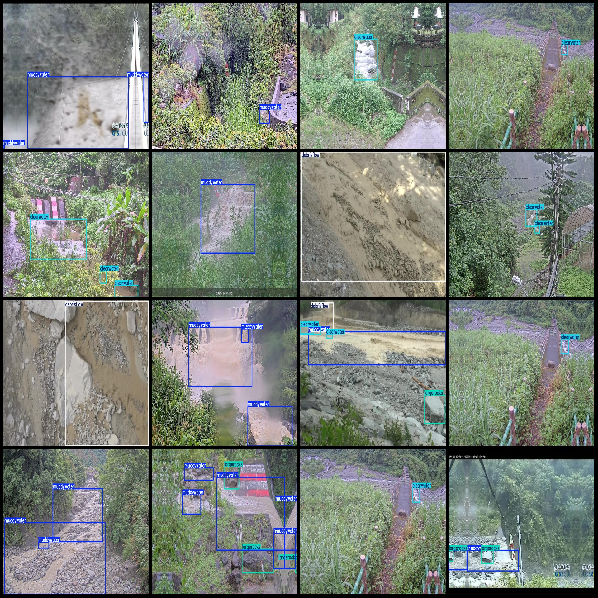
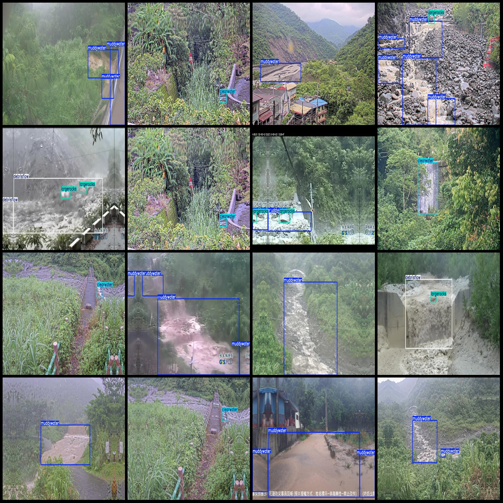

# Drone-Viewed Mudslide Detection Dataset VOC+YOLO Format with 21214 Images in 4 Categories

Dataset Format: Pascal VOC format + YOLO format (excluding split path txt files, only containing JPG images as well as corresponding VOC format xml files and YOLO format txt files).
Number of Images (JPG File Count): 21214
Number of Annotations (XML File Count): 21214
Number of Annotations (TXT File Count): 21214
Number of Annotation Categories: 4
Annotation Category Names (Note that the order of categories in the YOLO format does not correspond to this list, but rather is based on the labels folder's classes.txt): ["Clearwater", "Debrisflow", 
"LargeRocks", "MuddyWater"]
Each Classification Number for Each Category:
Clearwater (Clean Water) Box Count = 23499
Debrisflow (Mudslide) Box Count = 6585
LargeRocks (Large Rocks) Box Count = 8248
MuddyWater (Mud Water) Box Count = 33079
Total Box Count: 71411
Image Resolution: 1280x720
Drone: DJI MAVIC 3
Collecting Height: 20-50m
Collecting Angle: 60-90°
Using Annotation Tool: labelImg
Annotation Rules: Drawing boxes around categories
Important Note: No special statement currently exists
Special Declaration: This dataset does not guarantee any accuracy in the models or weights trained on it

**Annotation Example**:

## Images

Here is a pay link on Stripe ( https://buy.stripe.com/3cs8yP7sY87d0vu9AB ). Please contact me lonlonago@foxmail.com after funding $89, and I will send you a complete data files , thank you!

